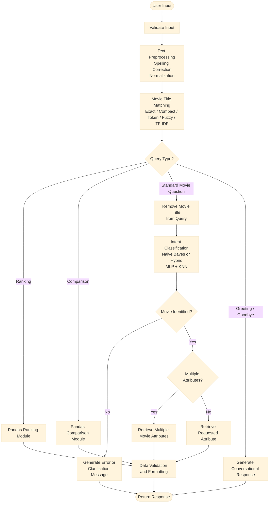

```mermaid
%%{init: {
  "theme": "base",
  "themeVariables": {
    "fontSize": "24px",
    "fontFamily": "Arial"
  },
  "flowchart": {
    "nodeSpacing": 60,
    "rankSpacing": 70,
    "curve": "basis"
  }
}}%%

flowchart TD
    A([User Input]) --> B[Validate Input]
    B --> C[Text Preprocessing<br/>Spelling Correction<br/>Normalization]
    C --> D[Movie Title Matching<br/>Exact / Compact / Token / Fuzzy / TF-IDF]
    D --> E{Query Type?}

    E -- Ranking --> F[Pandas Ranking Module]
    E -- Comparison --> G[Pandas Comparison Module]
    E -- Standard Movie Question --> H[Remove Movie Title<br/>from Query]
    E -- Greeting / Goodbye --> I[Generate Conversational Response]

    H --> J[Intent Classification<br/>Naive Bayes or Hybrid<br/>MLP + KNN]
    J --> K{Movie Identified?}

    K -- No --> L[Generate Error or<br/>Clarification Message]
    K -- Yes --> M{Multiple Attributes?}

    M -- Yes --> N[Retrieve Multiple Movie Attributes]
    M -- No --> O[Retrieve Requested Attribute]

    N --> P[Data Validation and Formatting]
    O --> P
    F --> P
    G --> P

    P --> Q([Return Response])
    I --> Q
    L --> Q
```